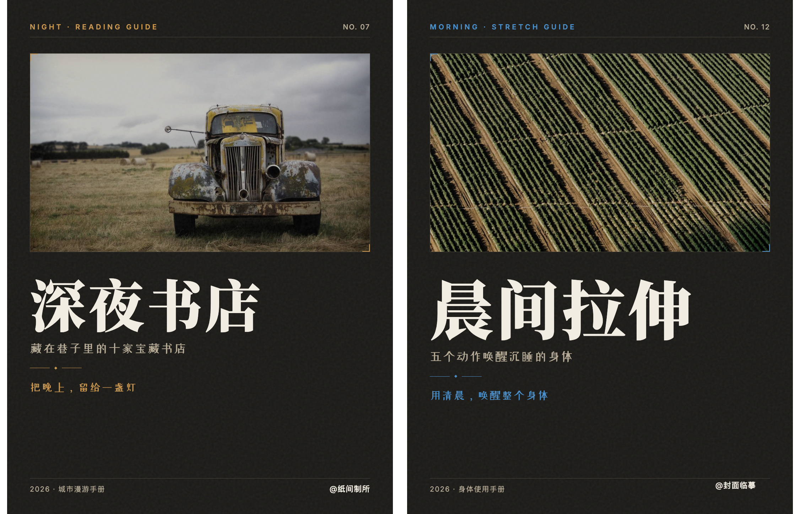
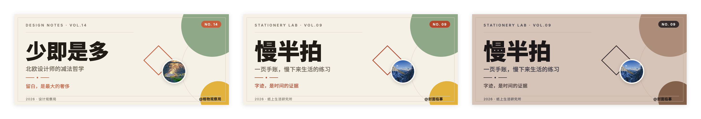

# 封面临摹（Cover Reverse）

看到好看的封面，临摹下来变成你自己的可编辑母版——学的是设计语法，换的是你的内容。

<!-- PLAYGROUND_LINK：Task 9 回填「在线试玩」链接 -->

## 效果长什么样

**案例一：小红书竖版封面临摹**



左边是参考图，右边是照它临摹出来的成品——版式、字体气质、配色手法学过来了，文字和图片全部换成了新的内容。（参考图为本项目自制示意，不是真实创作者的作品。）

**案例二：横版公众号头图 + 配色换肤三联**



三张依次是：参考图 → 照原图临摹出的成品 → 用另一张图的配色给成品"换肤"后的版本。同一套版式，颜色一换就是新气质。（参考图为本项目自制示意，不是真实创作者的作品。）

## 它和 AI 生图有什么不同

**可控不抽卡。** 直接让 AI 一次性画一整张封面图，本质上是在抽卡——每次点"生成"都是重新抽奖，出来的版式、字体、配色都不受你控制，想微调一个小细节往往得推倒重来、再抽一次。封面临摹不这样：它把封面拆成一份可编辑的网页文件（也就是常说的 HTML，你可以理解成"网页的源代码"），标题、颜色、位置全都是里面一个个独立的参数，想改哪个改哪个，不用整张图重新抽。

**中文字永远不会错。** AI 生图模型在"画"文字的时候经常写错字、笔画缺胳膊少腿，业内管这个毛病叫"文字幻觉"。封面临摹从根上绕开了这个坑：你看到的标题、副标题从头到尾都是你自己打出来的真实文字（网页里的文字，不是 AI 画出来的图案），电脑天生就会原样显示你打的每一个字，压根不存在"画错字"这回事。

**一次临摹＝一条生产线。** 临摹一次拿到的不只是一张图，还有一份能反复使用的"母版"（就是那份 HTML 模板文件）。下次想出同系列的新封面，只要把文案、图片换一下，几秒钟就能出下一张，不用每次都从头再临摹一遍——相当于给自己攒了一条能不断复用的封面生产线。

**内置版权卫生。** 临摹只学别人封面的排版思路、配色搭配、字体气质这些"设计语法"，绝不会把别人的署名、水印、原文案、插画这些"版权内容"带进你的成品。这条规则是写死在流程里的，不需要你提醒，哪怕你说"就要一模一样、原样还原"，涉及别人版权的部分也不会被照搬——详见下面 FAQ 的第一条。

**零代码精调。** 拿到的可调版文件自带一个可视化操作面板：改文字直接在输入框里打字、换颜色直接点色板、想挪动标题位置直接用鼠标拖，全程不需要你懂任何代码。"HTML"这种专业说法只存在于幕后，你实际看到、操作的永远是所见即所得的调整界面。

**不烧额度＋版本可回退。** 因为不是每次调整都要重新调用 AI 重画一整张图——AI 只在最开始的"临摹分析"这一步用一次，后面调文字、调颜色、拖位置、导出图片，全是浏览器和代码在本地完成的，不会额外消耗你的 AI 生成额度（也就是调用 AI 的次数或费用）。而且每改一版都会另存成新版本（v1、v2、v3……），旧版本永远保留不删，改坏了随时能退回上一版，不怕越改越乱。

## 适合什么内容

- 小红书封面（竖版 3:4）
- 公众号头图（横版 2.35:1）
- B 站封面（横版 16:10）
- 知识卡片（方图 1:1，通用尺寸）
- 视频封面（横版 16:9）
- 竖版视频封面（9:16，适合抖音、视频号）
- 活动海报封面（自定义任意宽×高）

## 安装

```bash
git clone https://github.com/<owner>/cover-reverse.git ~/.claude/skills/cover-reverse
```

装好之后重启一下 Claude Code 就能用了；如果你用的是其他支持 "Agent Skills"（也就是能加载"技能包"文件夹的 AI 编程工具）的工具，把这个文件夹放进它自己的技能目录就行，用法完全一样。

## 使用流程

1. **你发参考图和文案给我。** 参考图是必须的；文案（也就是你封面上要放的文字）如果暂时没想好，我会先问你一句，不会替你瞎编。
2. **我分析完，交给你一份"可调版" HTML。** 这是一份可以在浏览器里直接打开的网页文件，左边是封面预览，右边带一个调整面板——这一步先不出最终的图片，是让你先确认效果对不对。
3. **你在浏览器里打开它，自己动手拖改。** 改文字直接在输入框打字、换颜色直接点色板、想挪动标题位置直接用鼠标拖，想换图直接点封面上的图片区域选一张自己的图，全程不用碰代码。
4. **改到满意后，点面板上的"复制参数"，把这段参数粘回来发给我。** 如果你中途换了自己电脑上的本地图片，也请把那张图一起发给我——因为本地图只存在于你浏览器里的预览中，不在文件里，我需要拿到原图才能用。
5. **我照你发回来的参数，在"干净母版"上出一张正式的 PNG 图给你。** "干净母版"指的是不带调整面板的那份 HTML——面板只是你调试用的工具台，不会出现在最终的成品图里。

## 四种玩法

- **逆向还原新封面：** 给一张参考图和你的文案，从零临摹出一份全新的可编辑封面母版。
- **对话修改：** 已经有母版了，直接说人话就能改，比如"标题换成楷体""背景换成米色""标题往下挪一点"，不用推倒重新临摹一遍。
- **配色换肤：** 拿另一张图里的配色，套到已有封面上——版式、字体、字号原封不动，只换颜色，常用于同一个封面系列出不同色号。
- **可调版自助调参：** 就是"使用流程"里那份带控制面板的 HTML，你可以自己反复试各种文字、颜色、位置的组合，满意了再让我出正式的成品图。

## FAQ

**这算抄袭吗？**

不算，因为流程里内置了一套"版权切分"机制，把参考图里的东西严格分成两栏：能学的是版式骨架、分区比例、对齐方式、字体气质、字号字距、配色方案、圆角描边这些"设计语法"；绝对不会带走的是别人的署名/账号名/水印、别人的原文案（标题、slogan、引文这些具体文字）、别人的照片/插画/logo/吉祥物这些"版权内容"。哪怕你明确要求"原样还原、一模一样"，署名和图源这些也会默认被换成中性的占位内容，不会把别人的东西直接搬进你的成品——这条规则不需要你提醒，是流程里自动执行的一步。替换占位内容时字数还会尽量对齐原文的字数（比如原来是 5 个字母的词，就换成差不多长度的占位词），这样排版效果能和参考图保持一致，你也能看出自己的文案大概该控制在多少字。

**没装浏览器工具怎么导出？**

可调版面板里自带一个"下载 PNG"按钮，点一下就能在你自己的浏览器里直接导出一张图，不需要额外装任何工具，这是零依赖的兜底方案。如果你的电脑上装了 agent-browser、Playwright 或者 Chrome 浏览器（这三个是我用来自动截图出图的工具，你装了哪个我就自动用哪个），我会用它帮你导出更精细的正式版大图，效果会比面板里的快速导出更好。

**能出别的尺寸吗？**

能。内置了几个常用尺寸预设：小红书封面（3:4）、公众号头图（2.35:1）、B 站封面（16:10）、方图（1:1）、视频封面（16:9）、竖版视频封面（9:16），你直接说要做哪个平台的封面，我就按对应尺寸做。如果这些预设都不合适，你也可以直接告诉我自定义的"宽×高"数值，比如"1200×630"，同样能做。

## License

MIT
